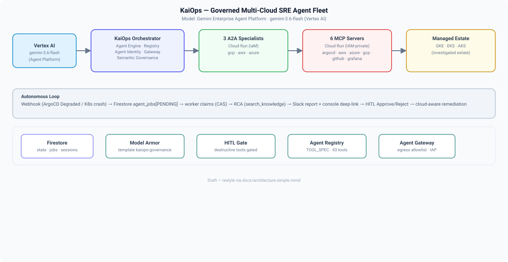

# KaiOps — Governed Multi-Cloud SRE Agent Fleet

**Google Cloud is the governed control plane; AWS, Azure and GCP workloads are the
managed estate the agent fleet investigates.**

KaiOps is an autonomous, human-in-the-loop **Site Reliability Engineering (SRE)
agent fleet** built on the **Gemini Enterprise Agent Platform** (Google ADK). When a
deployment crashes or degrades, KaiOps detects it end-to-end (ArgoCD health /
Kubernetes events), runs a **root-cause analysis (RCA)** grounded in its RAG/runbook
knowledge base, posts a **Slack report** with a deep-link to a live console session,
and — once an operator **approves** the remediation (HITL gate) — executes the fix
across **GKE, EKS or AKS** using the target cloud's native APIs.

> **Track:** Fortified Enterprise Fleet · **Model:** `gemini-3.6-flash` (Vertex AI)

---

## 🎯 Problem Statement

Production outages are expensive and cross-cloud. An SRE on-call must triage an
incident across **GCP, AWS and Azure**, pull logs + metrics from **three different
providers**, correlate them with **Grafana / Prometheus alert state**, consult
**runbooks**, and apply a fix — often at 2 AM under pressure. Most of that is
repetitive and mechanical, but current agents are either single-cloud or
"answer-only" chatbots that can't perform a governed, cross-cloud remediation.

**KaiOps makes the SRE agent the operator's teammate:** it *watches* the fleet,
*investigates* autonomously, *explains* the root cause with observability evidence,
and *executes* a fix only after a human approves it — across any cloud.

---

## 🏆 The Autonomous Loop

```
webhook (ArgoCD Degraded / K8s crash) → Firestore agent_jobs[PENDING]
→ worker claims (status-guarded CAS) → RCA (grounded by search_knowledge)
→ Slack report + console deep-link → HITL Approve/Reject
→ cloud-aware remediation (GKE / EKS / AKS) → recovered
```

**Failure tolerance:** the worker claims a `PENDING` job via a status-guarded
compare-and-swap so no two workers ever execute the same job (no double-claim).
Each agent run is bounded by a job timeout (`KAIOPS_JOB_TIMEOUT_SECONDS`, default
900s) and a bounded number of re-claims (`KAIOPS_JOB_MAX_ATTEMPTS`, default 2); on
timeout or a persistent failure the job is moved to the terminal `FAILED` state
rather than looping forever.

---

## Architecture



For a detailed, live inventory of the deployed mesh (Cloud Run revisions, Agent
Engine orchestrators, MCP servers, load balancer, certificates) see
[`docs/architecture-system.png`](docs/architecture-system.png) (and
[`docs/architecture-live-inventory.png`](docs/architecture-live-inventory.png)).

> **Why this stack:** Cloud Run gives per-service scale-to-zero + IAM-private MCP
> endpoints; Firestore is the source of truth for jobs/sessions/metadata so a
> crashed worker can resume; Vertex AI + ADK give a real agent framework (not a
> prompt wrapper); Secret Manager + the HITL gate keep destructive actions governed.

---

## Hackathon Requirements Compliance

| Mandatory requirement | Where it is met in this repo |
|---|---|
| Gemini 3.5+ (Gemini API / Vertex AI) | `apps/api/agents/*` — model default `GEMINI_MODEL=gemini-3.6-flash` via Vertex AI (`GOOGLE_GENAI_USE_VERTEXAI=1`) |
| A Google agent framework | Google ADK (`LlmAgent`, `sub_agents`, `FunctionTool`, `AdkApp`) in `apps/api/agents/sre_agent/agent.py` |
| ≥ 1 GCP infrastructure service | Cloud Run (backend + 3 A2A specialists + 6 MCP servers), GKE + CI/CD (`deploy-to-gke.yml`), Firestore (metadata / sessions / `agent_jobs`), Vertex AI Agent Engine, Secret Manager, Cloud Build, Artifact Registry, Cloud Logging / Monitoring, IAP |

---

## Fortified Enterprise Fleet Pillars

| Pillar | Status | Evidence / link |
|---|---|---|
| **Agent Registry** | 🔶 custom (not platform) | Global Agent Registry with 6 `TOOL_SPEC` MCP servers (43 tools); A2A specialists registered as Cloud Run A2A endpoints. **Note:** we ship our own registry on Cloud Run rather than the Vertex platform registry — see [`docs/FEATURE_PROGRESS.md`](docs/FEATURE_PROGRESS.md) |
| **Agent Runtime** | ✅ live | Firestore-backed job queue (`agent_jobs`) + autonomous worker loop (`/api/v1/runtime/worker/run`) |
| **Memory Bank** | ✅ live (RAG) | Vertex AI Search corpus (`kaiops-knowledge-us-east5`) + `search_knowledge` tool grounded on runbooks / past incidents / approved feedback |
| **Agent Identity** | ✅ live | Agent Engine `AGENT_IDENTITY` (SPIFFE) on the gateway-bound orchestrator |
| **Agent Gateway** | 🔶 partial | egress allowlist + IAP **live**; full `A2A_AGENT` registry routing is a documented platform limitation — see [`docs/GATEWAY_FINDING.md`](docs/GATEWAY_FINDING.md) |
| **Model Armor** | 🔶 partial (honest) | provisioned as template `kaiops-governance-template`; the Agent Gateway exposes **no** model-armor binding field, so enforcement is **app-layer**, plus an independent HITL gate on destructive tools |
| **Observability** | ✅ live | Cloud Logging / Monitoring queries in the GCP RCA agent + **Grafana dashboards/alerts auto-provisioned per app**; gateway decision-log runbook [`apps/api/runbooks/gateway-observability.md`](apps/api/runbooks/gateway-observability.md) |

---

## Grafana Observability (built-in, per-app)

Every KaiOps-registered application gets an auto-provisioned **Grafana dashboard +
Prometheus alert rule** the moment it registers (zero-touch, via the ArgoCD poller).
The RCA agent then pulls **live** Grafana data — dashboard link, firing alert state,
and Prometheus metrics (CPU / memory / pod restarts) — and surfaces it in the report.

- Dashboard uid: `kaiops-{app}` · Alert rule uid: `kaiops-{app}-alert`
- Foldered under `KaiOps` in Grafana; 10 registered apps each have dashboard + alert
- Implemented in `apps/api/agents/grafana_agent/provision.py`; surfaced in the RCA
  via the Grafana MCP tools (`search_dashboards`, `list_alert_rules`, `query_prometheus`)

---

## Cloud-Aware (not just GCP)

The ArgoCD poller **auto-registers** each discovered app and **infers its cloud
provider** from the cluster destination (AKS → azure, EKS → aws, else gcp), so
Azure and AWS apps get the right routing + Grafana provisioning without manual
Firestore edits. The executor applies remediation via GKE/EKS/AKS native APIs.

- **GCP**: `kaiops-demo-app`, `gcp-todo-app`, `gcp-todo`
- **Azure**: `kaiops-azure-demo` (verified end-to-end on AKS `my-demo-cluster`), `azure-to-do`
- **AWS**: `kaiops-aws-demo` (registered + Grafana; live EKS ops scaffold-only)

See [`docs/WEBHOOK_TRIGGER.md`](docs/WEBHOOK_TRIGGER.md).

---

## Repository Structure (as it is)

| Path | Purpose |
|---|---|
| `apps/api` | **Backend** (FastAPI + Google ADK). Build context for the deployed Cloud Run service (`infrastructure/docker/Dockerfile.backend` → `COPY apps/api/`) |
| `apps/api/app` | FastAPI routers: `applications/`, `auth/`, `chat/` (sessions + HITL approve/reject), `runtime/` (job queue + worker), `slack/`, `feedback/`, `metadata/` |
| `apps/api/agents` | The agent fleet: `sre_agent/` (root), `gcp_rca_agent/`, `azure_rca_agent/`, `aws_rca_agent/`, `argocd_agent/`, `github_agent/`, `grafana_agent/`, `metadata_agent/`, `k8s_crash_watcher.py`, `executor.py` (cloud-aware remediation) |
| `apps/web` | **Frontend** (React + Vite). Build context for `kaiops-web` |
| `kaiops-gcp`, `kaiops-aws`, `kaiops-azure` | **A2A specialist** container contexts (Cloud Run). Each is a parallel deployment, NOT duplicates — do not merge/delete |
| `mcp-servers/` | 6 IAM-private Cloud Run MCP servers (argocd / aws / azure / gcp / github / grafana) + `shared/mcp_proxy.py` |
| `agent-runtime/` | Agent Engine wrapper / A2A mesh glue |
| `infrastructure/` | Dockerfiles, Cloud Build triggers, GKE/K8s manifests, load balancer Terraform |
| `docs/` | Architecture, gateway findings, feature progress, test reports, architecture diagrams |
| `kaiops/` | Governed-deployment variant (Agent Engine runtime source, `deploy_governed.py`). In progress / parallel to `apps/api` |

---

## Proven Working State (evidence)

This is not a scaffold — it has been **run end-to-end on the deployed mesh**
(project `project-3da8cb5f-328e-44d3-b7a`, region `us-central1`).

| Proof | Result | Where |
|---|---|---|
| Health + auth + 10 registered apps | ✅ 200 / 10 apps | [`docs/E2E_TEST_REPORT.md`](docs/E2E_TEST_REPORT.md) |
| Autonomous RCA trigger → COMPLETE report | ✅ worker `processed:1, success:true` | [`docs/E2E_TEST_REPORT.md`](docs/E2E_TEST_REPORT.md) |
| GCP + Azure RCA (cloud-aware, real Grafana data) | ✅ no misroute; live alert state + metrics | [`docs/E2E_TEST_REPORT.md`](docs/E2E_TEST_REPORT.md) |
| Slack `#incidents` per-app thread (Failed → RCA reply) | ✅ parent + sub-reply verified | [`docs/E2E_TEST_REPORT.md`](docs/E2E_TEST_REPORT.md) |
| HITL approve → tool runs; reject → tool blocked | ✅ both verified | [`docs/E2E_TEST_REPORT.md`](docs/E2E_TEST_REPORT.md) |
| Grafana dashboards + alerts for every app | ✅ 11 dashboards, 10 alerts | `apps/api/agents/grafana_agent/provision.py` |

---

## Spin-Up

### Local development (backend + frontend)

The backend reads its configuration from environment variables. The authoritative
list on the deployed service (Cloud Run) is below; for local use set the same keys.

| Env var | Default / example |
|---|---|
| `GOOGLE_CLOUD_PROJECT` | `project-3da8cb5f-328e-44d3-b7a` |
| `GOOGLE_CLOUD_LOCATION` | `global` (model endpoint) |
| `GOOGLE_GENAI_USE_VERTEXAI` | `1` |
| `GEMINI_MODEL` | `gemini-3.6-flash` |
| `ENVIRONMENT` | `production` |
| `ALLOWED_ORIGINS` | `*` |
| `KAI_OPS_FRONTEND_URL` | `https://kaiops-sre.searceinc.net` |
| `SEED_DEMO_USERS` | `false` |
| `AZURE_MOCK_MODE` | `false` |
| `GKE_CLUSTER_NAME` / `GKE_CLUSTER_LOCATION` | `gcp-demo-cluster` / `us-central1-a` |
| `AZURE_TENANT_ID` / `AZURE_CLIENT_ID` / `AZURE_SUBSCRIPTION_ID` | (your Azure service principal) |
| `AZURE_RESOURCE_GROUP` / `AZURE_AKS_CLUSTER_NAME` | `dontdelete` / `my-demo-cluster` |
| `ARGOCD_URL` / `ARGOCD_USERNAME` | `https://34.61.13.1` / `admin` |
| `GRAFANA_URL` / `GRAFANA_USERNAME` | `http://34.9.192.101` / `admin` |
| `VERTEX_SEARCH_DATA_STORE_ID` | (your RAG data store) |
| `KUBE_API_URL` / `KUBE_API_VERIFY_TLS` | cluster API endpoint / `true` |
| `AWS_REGION` / `AWS_CLUSTER_NAME` | `ap-southeast-2` / `kaiops-demo-cluster` |
| `AWS_CLOUDWATCH_LOG_GROUP` | (your CloudWatch group) |
| `AWS_MCP_URL` | (your AWS MCP server URL) |
| `SLACK_CHANNEL` | `#incidents` |
| `MCP_URL_ARGOCD/AZURE/GITHUB/GRAFANA/AWS` | (your MCP server URLs) |

Secret-backed (set via Secret Manager, never committed): `SECRET_KEY`,
`AZURE_CLIENT_SECRET`, `AWS_SECRET_ACCESS_KEY`, `KAIOPS_RUNTIME_TOKEN`,
`SLACK_WEBHOOK_URL`, `ARGOCD_AUTH_TOKEN`, `ARGOCD_PASSWORD`, `GITHUB_TOKEN`,
`GRAFANA_TOKEN`, `GRAFANA_PASSWORD`, `AWS_ACCESS_KEY_ID`,
`KAI_OPS_DEPLOY_WEBHOOK_TOKEN`, `SLACK_BOT_TOKEN`, `SLACK_SIGNING_SECRET`.

**Run locally:**

```bash
# backend
cd apps/api && uvicorn app.main:app --host 0.0.0.0 --port 8000
# frontend
cd apps/web && npm ci && npm run dev
```

### Deploy to Google Cloud

- Backend: `infrastructure/k8s/deploy-backend-cloudrun.bat` (Cloud Build → Cloud Run)
- Frontend: `infrastructure/k8s/deploy-frontend-cloudrun.sh`
- A2A mesh: `deploy-a2a-mesh.ps1` (builds from `kaiops-gcp|aws|azure`)
- CI/CD for GKE: `.github/workflows/deploy-to-gke.yml`

---

## Insights & Things I'm Proud Of

- **Cross-cloud SRE autonomy.** Most hackathon agents are single-cloud. KaiOps's
  poller infers AKS/EKS/GKE and routes the RCA + remediation to the right cloud
  without a human editing metadata — genuinely multi-cloud.
- **First-class observability in the RCA.** Rather than a "status" chatbot, KaiOps
  auto-provisions a Grafana dashboard + alert for *every* registered app and the RCA
  cites *live* alert state + Prometheus metrics. The report reads like a real SRE's
  diagnosis, not a summary.
- **Governed destructive actions.** `restart_pod`, `rollback_application`, and
  `sync_application` are behind a HITL approve/reject gate with single-use tokens,
  session/user binding checks, and cross-user tamper-resistance — so a model can't
  mutate production without a human signing off.
- **Honest about platform limits.** The Agent Gateway, Model Armor binding, and
  platform Agent Registry all have documented platform constraints. We disclose
  them rather than over-claim (see `docs/`).

---

## Findings & Learnings

- **Agent Gateway SWP/mTLS egress** is the single biggest platform constraint — the
  gateway CONNECT is validated at the Google-managed Secure Web Proxy layer. See
  [`docs/GATEWAY_FINDING.md`](docs/GATEWAY_FINDING.md).
- **A2A_AGENT registry routing** is not exposable via the services registry — the
  orchestrator reaches specialists via Cloud Run URL + `A2A_SHARED_TOKEN`.
- **Model Armor has no gateway binding field** (google-managed gateway) — enforcement
  is app-layer, complemented by the HITL destructive-action gate.
- **Agent Registry:** we use our own Cloud Run-based registry rather than the Vertex
  platform registry. Disclosed honestly; the product still satisfies agent
  registration, tool registry, and multi-agent orchestration requirements.
- See [`docs/FEATURE_PROGRESS.md`](docs/FEATURE_PROGRESS.md) for the full governance
  bundle status.

---

## Disclosure

Portions of this repository's initial scaffolding were generated from Google's
`agent-starter-pack` template (early project structure / boilerplate). All agent
logic, the cloud-aware executor, the cross-cloud poller + auto-registration, the
Grafana provisioning, and the governed HITL flow are original work in this repo.

**Author:** `laxmanawate18` · **Submission:** All Things Agentic Hackathon
(Fortified Enterprise Fleet) · **Date:** 2026-08-31.

---

*Model Armor is spelled with a space in the submission materials; the code key is
`model_armor`, which is a frontend contract with `ApprovalCard.tsx`.*
