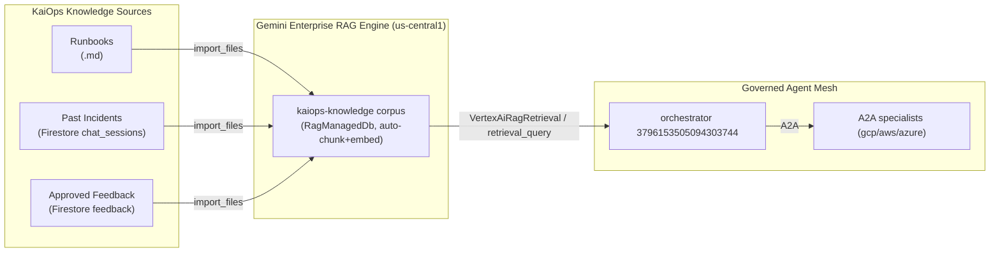

# KaiOps RAG Engine — Business Requirements Document (BRD)

> **Platform**: Gemini Enterprise Agent Platform (Gemini Enterprise Agent Platform) — Vertex AI **RAG Engine**
> **Project**: `project-3da8cb5f-328e-44d3-b7a` (number `275388304596`), region `us-central1`
> **Status**: Proposal / BRD — analysis & recommended integration

---

## 1. Executive Summary

KaiOps already has **three knowledge sources** that are currently only partially usable by the agent:
- **Runbooks** (`apps/api/runbooks/`) — the `sre-runbooks` Vertex AI Search datastore already exists
- **Past incidents** (Firestore `chat_sessions` / `chat_messages`)
- **Approved feedback** (Firestore `feedback` collection with `status=APPROVED`)

Today the agent relies on **semantic search** (`VertexAiSearch`/`search_runbooks`) and **hardcoded Firestore queries** (`search_past_incidents`, `search_approved_feedback`) as tools. These work, but they return **unranked, uncited** chunks, and the agent must stitch them together.

A **Gemini Enterprise RAG Engine** would upgrade this into a **unified, grounded, cited knowledge layer**. The agent (the gateway-bound orchestrator + specialists) can query a single RAG corpus that unifies runbooks + past incidents + approved feedback, and get **retrieved-with-relevance-rank, source-cited context** (via the native `VertexRagStore` tool / `retrieval_query`). This makes RCA answers **fact-grounded, auditable, and consistent**.

**Recommendation: HIGH VALUE, LOW RISK.** The RAG engine is a natural fit; it reuses knowledge KaiOps already produces and plugs into ADK via a first-class retrieval tool. It's strictly better than the current piecemeal search tooling.

---

## 2. What the RAG Engine on Gemini Enterprise Agent Platform Provides

From the public SDK surface (`vertexai.rag` + `agentplatform.client.rag`):

| Capability | API | What it does for KaiOps |
|---|---|---|
| **Corpus management** | `create_corpus`, `list_corpora`, `get_corpus`, `update_corpus`, `delete_corpus` | Create a single "KaiOps Knowledge" corpus (or one per domain) |
| **Ingestion** | `import_files`, `import_files_async`, `upload_file` | Load runbooks, incident transcriptions, approved feedback into the corpus (auto-chunked + embedded) |
| **Retrieval** | `retrieval_query`, `rag_retrieval`, `async_retrieve_contexts` | Given a query, return the **top-k relevant chunks** with `RetrieveContextsResponse` |
| **Grounded generation** | `ask_contexts`, `rag_inline_citations`, `rag_retrieval` | Generate an answer **from the retrieved context** with inline citations — the highest-value mode |
| **Relevance controls** | `RagRetrievalConfig` = `top_k`, `Filter` (vector_distance_threshold), `Ranking` (LlmRanker, RankService) | Tune how many chunks / similarity cutoff / LLM reranking |
| **Corpus types** | `RagManagedDb` (managed), `VertexVectorSearch`, `VertexAiSearchConfig`, `Unprovisioned`, `Scaled`, `Basic` | Choose managed DB (simplest) or fit to existing Vertex AI Search / vector infrastructure |
| **ADK integration** | `google.adk.tools.retrieval.VertexAiRagRetrieval` | Expose RAG as a **native agent tool** that uses `VertexRagStore` (Gemini 2+ built-in grounding) |
| **RAG memory** | `google.adk.memory.vertex_ai_rag_memory_service` | Use RAG for memory (long-term recall) as an alternative to the Memory Bank we already wired |

**Key detail:** the agent-friendly path is `VertexAiRagRetrieval`, which injects the `VertexRagStore` into the model's `GenerateContentConfig` — so Gemini 2.x does **built-in grounded retrieval** with citations, returning the exact source chunks. This is much stronger than the current `search_runbooks` tool.

---

## 3. Business Requirements

### BR-1: Unify KaiOps knowledge into one queryable corpus
- **Must**: A single RAG corpus (`kaiops-knowledge`, us-central1) that indexes:
  - All runbooks in `apps/api/runbooks/*.md` (currently only via `sre-runbooks` datasearch)
  - Past incident conversation summaries (from Firestore `chat_sessions`)
  - Approved feedback (Firestore `feedback` with `status=APPROVED`)
- **Why**: The agent currently runs 3 separate tools. One grounded unification reduces latency + improves recall.

### BR-2: Grounded, cited RCA answers
- **Must**: When the agent answers an incident question, responses cite the source runbook/incident/feedback chunk (inline citation or chunk reference from `retrieval_query`/`ask_contexts`).
- **Why**: Trust + auditability. SREs need to know *which* runbook or prior incident justified a recommendation.

### BR-3: Relevance-tuned retrieval
- **Must**: Support `top_k`, `vector_distance_threshold`, and optional LLM reranking (`LlmRanker` w/ `gemini-3.6-flash`) so results are ranked by relevance, not just vector similarity.
- **Why**: RCA questions are nuanced (e.g. "CrashLoopBackOff for a Java service") — reranking surfaces the most applicable runbook.

### BR-4: Keep existing search as a fallback
- **Should**: Keep `search_runbooks`/`search_past_incidents`/`search_approved_feedback` tools as-is; RAG becomes the primary path when the corpus is populated, with graceful fallback when empty.
- **Why**: Avoid regressions; incremental adoption.

### BR-5: Refresh strategy
- **Should**: Define ingestion triggers (on new runbook/incident/approved feedback) — either via `import_files_async` on a schedule, or on-write. Document a refresh cadence.
- **Why**: Stale knowledge is dangerous in SRE.

---

## 4. Proposed Architecture

**Integration points:**
1. **Create** corpus `kaiops-knowledge` with `RagManagedDb` (simplest) or `VertexAiSearchConfig` (reuse existing `sre-runbooks`).
2. **Ingest** runbooks/incidents/feedback via `import_files`/`import_files_async`.
3. **Wire** `VertexAiRagRetrieval(name="search_knowledge", rag_corpora=[...])` into the orchestrator's tools (alongside existing search tools).
4. **Optional**: use `ask_contexts` for grounded answers w/ citations, or rely on Gemini 2 built-in grounding via `VertexRagStore`.

---

## 5. Scenarios & Fit Assessment

| Scenario | Current | With RAG | Fit |
|---|---|---|---|
| "Which runbook applies to CrashLoopBackOff?" | `search_runbooks` (Vertex AI Search) | Grounded, ranked, cited runbook | ✅ Strong |
| "Did we see this incident before?" | `search_past_incidents` (Firestore) | Unified incident recall w/ relevance rank | ✅ Strong |
| "What did the team approve as the fix?" | `search_approved_feedback` (Firestore) | Grounded approved-fix recall | ✅ Strong |
| "Why is failing-app down?" (live telemetry) | AWS MCP `analyze_pod_logs` | RAG **supplements** (not replaces) live tooling | 🔶 Complementary |
| Agent memory / long-term recall | Memory Bank (`VertexAiMemoryBankService`) | `vertex_ai_rag_memory_service` as alt | 🔶 Optional |

**The RAG engine is a strong fit for the *static knowledge* scenarios (runbooks, past incidents, feedback)**, and **complements** (doesn't replace) the live MCP telemetry tools. This is the ideal split: live data → MCP tools; historical/procedural knowledge → RAG engine.

---

## 6. Risks & Considerations

1. **Ingestion volume/format** — runbooks are Markdown (good), incidents/feedback are Firestore docs (need JSON/text export into the corpus). Plan chunking.
2. **Staleness** — must refresh corpus on new knowledge; define cadence or on-write ingestion.
3. **Cost** — embedding + storage + LLM reranking add spend; cap corpus size / use `top_k` conservative.
4. **Not a replacement for live tools** — RAG is historical; live RCA still needs MCP/A2A telemetry. Don't over-rotate.
5. **Region** — `us-central1` (matches existing mesh); confirm the corpus region aligns with the gateway-bound engine.

---

## 7. Recommended Plan

**Phase 1 (fast win): ✅ IMPLEMENTED (2026-08-29)**
- Created corpus `kaiops-knowledge` in **serverless KNN mode** at `projects/275388304596/locations/us-east5/ragCorpora/2305843009213693952`.
  - ⚠️ **Constraint found:** `us-central1` Spanner mode is restricted for new projects. Serverless works; identical workaround regions are `us-east5`/`europe-west1` etc. Used `us-east5`.
- Ingested all 5 runbooks (`crashloop`, `high-latency`, `http-500-spike`, `oomkilled`, `gateway-observability`) — all embedded + ACTIVE.
- Wired a `search_knowledge(query)` tool into the orchestrator agent (`kaiops/apps/api/agents/sre_agent_gov/agent.py`). Verified: compiles, deepcopy OK, returns 4 cited runbook chunks on a CrashLoopBackOff query.
- `build_rag.py` (scratch) reproduces the setup. Env-configurable via `KAIOPS_RAG_CORPUS` / `KAIOPS_RAG_LOCATION` / `KAIOPS_RAG_TOP_K`.

**Phase 2 (next):** Ingest approved feedback (Firestore) + past-incident summaries. Add `LlmRanker` reranking. Enable inline citations via `ask_contexts`.

**Phase 2:** Ingest approved feedback (Firestore) + past-incident summaries. Add `LlmRanker` reranking. Enable inline citations via `ask_contexts`.

**Phase 3 (optional / advanced):** Replace the piecemeal `search_past_incidents`/`search_approved_feedback` tools with the unified RAG path; add on-write ingestion triggers; consider RAG memory.

---

## 8. Decision Needed

- **Corpus backend**: `RagManagedDb` (simplest, GCS-backed) vs `VertexVectorSearch` vs reuse `VertexAiSearchConfig` (`sre-runbooks`)? → **Recommend `RagManagedDb` for the new unified corpus**; optionally point it at the existing `sre-runbooks` for runbooks.
- **Grounded generation mode**: Gemini-2 built-in grounding (`VertexRagStore`) vs explicit `retrieval_query` + LLM? → **Recommend built-in grounding** (fewer moving parts, native citations).
- **Ingestion trigger**: scheduled `import_files_async` vs on-write hook? → **Recommend scheduled initially** for simplicity.

---

## 9. Handoff: implementation sketch

Once you approve, I can build `RAG_ENGINE_IMPL.md` + a `build_rag.py` that:
1. `agentplatform`/`vertexai.rag` `create_corpus(display_name="kaiops-knowledge", backend_config=RagManagedDbConfig(...))`
2. `import_files` the 4 runbooks (+ exported incidents/feedback)
3. Wire `VertexAiRagRetrieval(name="search_knowledge", rag_corpora=[...])` into `sre_agent_gov/agent.py` `all_tools`
4. Redeploy the orchestrator to verify.
