# Deployment-Failure Trigger + Cloud-Aware Remediation

> Turns KaiOps from an "advisor" into an "operator": a failed/crashed deployment
> automatically triggers an RCA, posts a **Slack report**, and embeds a **console
> deep-link** so a developer can click straight into the live incident conversation
> and take action (restart / rollback — always HITL-gated).

## Flow

```mermaid
flowchart LR
    ARGO["ArgoCD health / K8s crash event<br/>(Degraded · CrashLoopBackOff · ImagePullBackOff · OOMKilled)"] -->|"POST /api/v1/runtime/webhooks/deploy"| WH["Webhook receiver<br/>cloud-aware · dedup"]
    WH --> JOB["agent_jobs → PENDING"]
    JOB --> W["/worker/run (Cloud Run job / cron)"]
    W --> RCA["KaiOps RCA<br/>grounded by search_knowledge"]
    RCA --> SLACK["Slack report + deep-link"]
    SLACK -->|"/console/{session_id}"| UI["KaiOps console session"]
    UI -->|"restart / rollback"| HITL["HITL approve (require_confirmation)"]
    HITL -->|"cloud-aware execute()"| CL["GKE / EKS / AKS"]
    CL --> R["App recovered"]
```



## Endpoints

### `POST /api/v1/runtime/webhooks/deploy`
Auth: HTTP `Authorization: Bearer <KAI_OPS_DEPLOY_WEBHOOK_TOKEN>` (fail-closed).

```json
{
  "cloud_provider": "gcp | aws | azure",
  "incident_type": "crashloopbackoff | deployment_degraded | imagepullbackoff | oom_killed | failed_scheduling | unhealthy",
  "application": "Payment Gateway",
  "namespace": "default",
  "pod_name": "web-7d9f-abc",
  "deployment": "web",
  "severity": "P1",
  "message": "optional context"
}
```

Response (created):
```json
{
  "status": "created",
  "job_id": "...",
  "incident_key": "payment gateway::crashloopbackoff",
  "session_id": "runtime-<job_id>",
  "session_link": "https://kaiops-sre.searceinc.net/console/runtime-<job_id>"
}
```
Response (deduped, an open job already exists for the same `application + incident_type`):
```json
{ "status": "deduped", "existing_job_id": "...", "incident_key": "..." }
```

## Cloud-aware remediation dispatch

`apps/api/agents/executor.py` — `execute(app_name, action, namespace, pod_name, deployment)`.

| Provider | restart | rollback | Credentials |
|---|---|---|---|
| `gcp` (GKE) | ✅ `k8s_executor.restart_pod_real` (existing) | rollback to previous ReplicaSet | ambient Google SA (`GKE_CLUSTER_NAME`/`GKE_CLUSTER_LOCATION`) |
| `aws` (EKS) | delete pod via EKS kubeconfig | rollout undo | `AWS_ACCESS_KEY_ID`/`AWS_SECRET_ACCESS_KEY` + `AWS_REGION`/`AWS_CLUSTER_NAME` (needs `aws eks get-token`) |
| `azure` (AKS) | delete pod via AKS kubeconfig | rollout undo | `AZURE_TENANT_ID`/`AZURE_CLIENT_ID`/`AZURE_CLIENT_SECRET` + `AZURE_SUBSCRIPTION_ID`/`AZURE_RESOURCE_GROUP`/`AZURE_AKS_CLUSTER_NAME` (needs `az aks get-credentials`) |

All actions are wrapped by `require_confirmation=True` (HITL gate) — a human must approve before anything executes.

## Env / secrets

| Var | Type | Purpose |
|---|---|---|
| `KAI_OPS_DEPLOY_WEBHOOK_TOKEN` | **Secret** (`kaiops-deploy-webhook-token`) | Auth for the deploy webhook. Fail-closed if unset. |
| `KAI_OPS_FRONTEND_URL` | env | Base URL for the console deep-link (default `https://kaiops-sre.searceinc.net`). |
| `KAIOPS_RUNTIME_TOKEN` | Secret | Auth for existing `/runtime/ingest` + `/worker/run`. |
| `KUBE_API_VERIFY_TLS` | env | Set `true` (was `false`) — required for a trusted operator. |

## Job dedupe
`jobs.find_open_by_fingerprint(incident_key)` returns the most recent
PENDING/RUNNING/WAITING_APPROVAL job with a matching
`metadata.incident_key`. Repeated alert re-fires for the same
`(application, incident_type)` are short-circuited (no duplicate RCAs).

## HITL (Firestore-backed)
`app/chat/pending_actions.py` now persists approval records to **Firestore**
(`pending_actions` collection) instead of an in-process dict, so approvals that
arrive minutes later (e.g. via Slack) survive Cloud Run scale-to-zero /
multi-instance recycles. Same public API (`create_pending` / `get_pending` /
`consume_pending` / `reject_pending`), so existing callers are unchanged.

## Next steps
- ✅ **`kaiops-deploy-webhook-token` secret created** in Secret Manager (v1), backend redeployed (rev `00065-6zr`).
- ✅ **Webhook verified live** on rev 00065:
  - No/wrong token → 401 (fail-closed) ✅
  - Valid GKE create → 200 (`status:created`, returns `job_id` + `session_link`) ✅
  - Same `application+incident_type` → `status:deduped` (no duplicate RCA) ✅
  - Invalid cloud provider → 422 ✅
  - Confirmed job in `agent_jobs` as `PENDING`/`deploy_webhook`, ready for a worker.
- **Point ArgoCD** at the webhook for `Degraded` transitions, or run a K8s crash-event watcher (sends the normalized payload).
- (Optional / Phase 3) Wire Slack approve/reject buttons via a Slack app + `/slack/interactions`.
