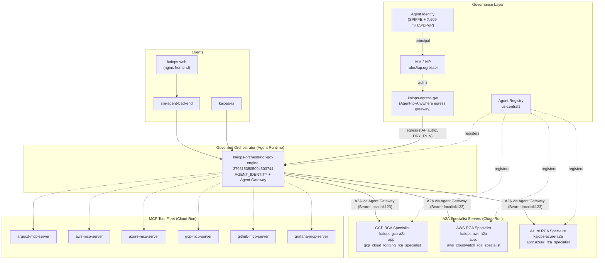

# KaiOps Governed A2A Mesh — Topology

> Captured 2026-08-29. Governed multi-cloud RCA agent mesh on Gemini Enterprise Agent Platform.
> Project `project-3da8cb5f-328e-44d3-b7a` (project number `275388304596`), region `us-central1`.

## Architecture Diagram

## Governed Mesh Inventory

### Orchestrator (Agent Runtime)
| Field | Value |
|---|---|
| Engine ID | `3796153505094303744` (gateway-bound) |
| Registry Agent | `agentregistry-...-404c-ab98fec4a53b` |
| Identity | `AGENT_IDENTITY` |
| Deploys via A2A to | GCP, AWS, Azure specialists (through the Agent Gateway) |
| A2A base URLs | Cloud Run service URLs |

### A2A Specialists (Cloud Run, real A2A cards + JSON-RPC)
| Specialist | Cloud Run URL | App name | Card path |
|---|---|---|---|
| GCP | `https://kaiops-gcp-a2a-rkapewlsyq-uc.a.run.app` | `gcp_cloud_logging_rca_specialist` | `/a2a/gcp_cloud_logging_rca_specialist/.well-known/agent-card.json` |
| AWS | `https://kaiops-aws-a2a-rkapewlsyq-uc.a.run.app` | `aws_cloudwatch_rca_specialist` | `/a2a/aws_cloudwatch_rca_specialist/.well-known/agent-card.json` |
| Azure | `https://kaiops-azure-a2a-rkapewlsyq-uc.a.run.app` | `azure_rca_specialist` | `/a2a/azure_rca_specialist/.well-known/agent-card.json` |

All specialists: `min-instances=1`, `max-instances=3`, `container-concurrency=36`, `A2A_SHARED_TOKEN=localtok123`.

### MCP Tool Fleet (Cloud Run)
- `argocd-mcp-server` — `https://argocd-mcp-server-rkapewlsyq-uc.a.run.app`
- `aws-mcp-server` — `https://aws-mcp-server-rkapewlsyq-uc.a.run.app`
- `azure-mcp-server` — `https://azure-mcp-server-rkapewlsyq-uc.a.run.app`
- `gcp-mcp-server` — `https://gcp-mcp-server-rkapewlsyq-uc.a.run.app`
- `github-mcp-server` — `https://github-mcp-server-rkapewlsyq-uc.a.run.app`
- `grafana-mcp-server` — `https://grafana-mcp-server-rkapewlsyq-uc.a.run.app`

### Frontend / Backend (Cloud Run)
- `kaiops-web` — `https://kaiops-web-rkapewlsyq-uc.a.run.app`
- `kaiops-ui` — `https://kaiops-ui-rkapewlsyq-uc.a.run.app`
- `sre-agent-backend` — `https://sre-agent-backend-rkapewlsyq-uc.a.run.app`

## Governance Layer
- **Agent Gateway**: `kaiops-egress-gw` — `AGENT_TO_ANYWHERE` (egress), bound to regional registry.
  - ✅ **WORKING**: gateway-mediated A2A session is now unblocked. Gateway-bound orchestrator `3796153505094303744` creates sessions (`CREATE SESSION OK`) and fully delegates A2A through the gateway. The IAP `AuthzPolicy` target uses the project **NUMBER** (`projects/275388304596/.../agentGateways/kaiops-egress-gw`), which was the root cause of the earlier block. See `GATEWAY_FINDING.md # KaiOps Agent Gateway — Egress: RESOLVED`.
- **Agent Registry**: `//agentregistry.googleapis.com/projects/<pn>/locations/us-central1` — agents + endpoints auto-registered.
- **Agent Identity**: per-engine `AGENT_IDENTITY`, principal `agentreg...` via `roles/iap.egressor`.
- **Auth for A2A**: `A2A_SHARED_TOKEN=localtok123` (Bearer header via `a2a_request_meta_provider`).

## Notes
- **Cold-start** mitigated: specialists are `min-instances=1` (no scale-to-zero).
- **Async throughput**: `container-concurrency=36` (multiple of 9 for ADK).
- The `*_noident` mesh + old gateway-bound engines still exist as historical artifacts; the live governed mesh is the orchestrator + 3 Cloud Run specialists.
