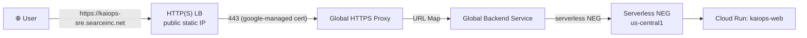

# Phase 2 — Frontend Load Balancer + Google-managed cert

> Domain: **`kaiops-sre.searceinc.net`**
> Frontend backend: **`kaiops-web`** (Cloud Run, `us-central1`, `--allow-unauthenticated`)

## Goal

Serve the KaiOps frontend at `https://kaiops-sre.searceinc.net` with a **Google-managed
SSL certificate** (auto-renewed) behind a **Google Cloud global HTTP(S) Load Balancer**.

## Architecture



- **Static global IP** — `136.68.165.163`, reserved, referenced by the HTTPS forwarder.
- **Google-managed cert** — domain `kaiops-sre.searceinc.net`, auto-renewed, no manual cert work.
- **Serverless NEG** — points straight at the `kaiops-web` Cloud Run service (no extra Ingress).
- **HTTPS-only** — single TLS forwarder on 443. (A separate port-80 redirect was intentionally
  omitted because the project's `IN_USE_ADDRESSES` quota (4) is fully consumed by 3 GKE target
  pools + the LB forwarder. Users reach the site via `https://` directly.)

## Files

| File | Purpose |
|---|---|
| `frontend-lb.ps1` | One-shot `gcloud` provisioning script (idempotent). |
| `frontend-lb.tf` | Terraform IaC equivalent — **applied & verified**. |
| `README.md` | Architecture + DNS step. |

## Status — ✅ APPLIED (2026-08-30)

Terraform applied successfully. Live resources (verified):
- `kaiops-web-ip` → **136.68.165.163** (global static IP)
- `kaiops-web-cert` → google-managed cert (MANAGED)
- `kaiops-web-backend` → global backend service (serverless NEG → `kaiops-web`)
- `kaiops-web-neg` → serverless NEG (us-central1)
- `kaiops-web-urlmap`, `kaiops-web-https-proxy`, `kaiops-web-https-forward` (443)

## ⚠️ CRITICAL: Point DNS (the one step IaC can't do)

For the google-managed cert to go `ACTIVE` and for `https://kaiops-sre.searceinc.net` to resolve:

```
kaiops-sre.searceinc.net    A    136.68.165.163
```

Also add an AAAA/NS only if you use IPv6 — for TLS bootstrap, the `A` record is sufficient.

> Google-managed certs verify ownership automatically by issuing a DNS challenge against the
> domain. Once the record propagates, the cert transitions PROVISIONING → ACTIVE (usually a few
> minutes). No manual challenge tokens needed.

## Security notes
- HTTPS-only (443). The port-80 redirect is omitted to respect the project IP quota; consider
  adding it after a quota increase if you want forced HTTPS from http:// links.
- The Cloud Run service stays `--allow-unauthenticated` because the LB is the public entry point
  and the serverless NEG reaches it server-side. For hardening, set the service ingress to
  `internal-and-cloud-load-balancing` so it's only reachable via the LB.

